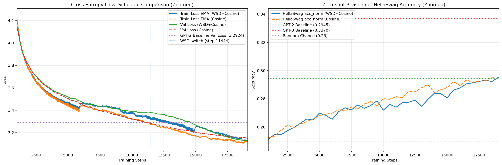

# Modernized Nano-GPT (124M)

本项目围绕 **GPT-2 Small（124M）** 尺度模型展开，目标是在**参数规模基本不变**的前提下，引入近年来语言模型中常见的一些结构和训练策略，考察它们在**固定训练预算**下是否能够带来稳定收益。

实验采用 **FineWeb-Edu 10B tokens**，并严格限制为 **single-pass** 训练。项目关注的不是单纯提升模型规模，而是在小模型设定下，分析现代化设计对训练效果、收敛行为和下游表现的影响。

从目前结果来看，在 124M 参数和 10B token 的约束下，现代化改造后的模型在验证损失和困惑度上优于常见 GPT-2 参考结果，同时在 HellaSwag 上达到与同量级 GPT-2 接近的表现。

---

## 一、项目目标

本项目主要回答以下问题：

在 **GPT-2 Small（124M）** 这一经典小模型规模下，如果不增加参数量，只对模型结构、优化器和训练策略进行现代化调整，是否能够在固定 token 预算内取得更好的训练结果？

围绕这一问题，本项目完成了以下工作：

- 在 NanoGPT 风格代码框架上实现一套现代化 GPT 训练方案
- 将模型规模控制在 **约 124M**
- 在固定 **10B tokens / single-pass** 条件下完成训练
- 对不同学习率调度方式进行了对照实验
- 对训练过程中的 loss、perplexity 和 HellaSwag 表现进行了分析

---

## 二、主要结果

在当前实验设定下，表现最好的模型为 **WSD+Cosine** 调度版本，其结果如下：

| 指标 | 本项目（Modern-NanoGPT） | 常见 GPT-2（124M）参考结果* |
| :--- | :---: | :---: |
| Validation Loss | **3.1290** | ~3.29 |
| Validation PPL | **22.85** | ~26.90 |
| HellaSwag acc_norm（peak） | **29.52%** | ~29.45% |

> 注：表中的 GPT-2 结果主要用于提供一个大致参照，并非严格意义上的完全同条件对比。不同项目之间在数据清洗、tokenization、训练细节和评测方式上可能存在差异，因此这些数值更适合做背景性比较，而不是直接作为严格结论。

从整体上看，本项目的结果说明：在小模型条件下，现代化结构和训练策略仍然能够带来较为明确的收益，尤其体现在验证损失和困惑度上。

---

## 三、训练曲线

训练过程中记录了 loss 与 HellaSwag 指标的变化情况，整体趋势如下图所示：

从曲线可以看到：

- **Cosine** 调度在中前期下降更快，较早出现收益；
- **WSD+Cosine** 在训练后期继续改善，最终取得更低的 validation loss 和 perplexity；
- 两种调度方式在最终 **HellaSwag** 上差距很小，说明更低的 perplexity 并不一定直接对应更高的下游判别表现。

---

## 四、模型与训练改动

相较于传统 GPT-2，本项目主要做了以下几类修改。

### 1. 模型结构

在结构层面，引入了以下现代化设计：

- **RoPE**：替代绝对位置编码
- **RMSNorm**：替代 LayerNorm
- **SwiGLU**：替代标准 GELU 前馈层
- **QK-Norm**：用于稳定 attention 中的 query / key 计算

注意力部分仍采用标准 **Multi-Head Attention**，未使用 GQA 等进一步压缩或改造方案，以便将实验重点放在基础结构升级本身。

### 2. 优化器设置

优化器采用 **Muon + AdamW** 的分组方式：

- 对主要的 **2D 权重矩阵** 使用 **Muon**
- 对其余参数（如 norm、bias 等）使用 **AdamW**

这样处理的目的，是在不改变整体训练框架的情况下，分别利用两类优化器在不同参数类型上的特点。

### 3. 权重共享

输入 embedding 与输出层采用 **weight tying**，以提高参数利用效率，并保持与经典语言模型训练设置的一致性。

### 4. 学习率调度

本项目额外比较了两种学习率调度方式：

- **WSD+Cosine**：Warmup + 60% Stable + 40% Cosine Decay
- **Pure Cosine**：Warmup + Cosine Decay

这一部分是本项目中较为重要的实验内容，因为它不仅影响最终指标，也影响收益出现的时间分布。

---

## 五、实验设置

### 模型规模

模型总体保持在 GPT-2 Small 级别：

- 参数量：**约 124M**
- 层数：**12 layers**
- 注意力头数：**12 heads**
- hidden size：**768**

### 训练数据与预算

- 数据集：**FineWeb-Edu**
- 总训练量：**10B tokens**
- 训练方式：**strict single-pass**
- 总步数：**19,073**
- 硬件：**4 × RTX 5090**

### Tokenization

- 使用 **GPT-2 BPE（tiktoken）**

整个实验尽量控制变量，重点考察现代化改动本身，而不是通过扩大模型规模或增加训练 token 数量来获得结果。

---

## 六、学习率调度对照实验

为了更清楚地观察调度策略的影响，本项目在其余设置保持一致的前提下，对两种 schedule 进行了对比：

| Schedule | Val Loss (final) | Val PPL (final) | HellaSwag acc_norm (peak) | HellaSwag acc_norm (final) |
| :--- | ---: | ---: | ---: | ---: |
| WSD+Cosine | **3.1290** | **22.85** | 29.52% | 29.43% |
| Cosine | 3.1505 | 23.35 | **29.56%** | **29.46%** |

从结果来看：

- **WSD+Cosine** 在最终 validation loss 和 perplexity 上更优；
- **Cosine** 在 HellaSwag 的 peak 和 final 上略高，但差距很小；
- 两者的差别更多体现在**训练收益出现的阶段**，而不仅仅是最终指标。

这说明学习率调度并不是简单的“谁更好”，而是会影响模型在训练中期和后期分别获得什么类型的收益。

---

## 七、评测说明

本项目在 HellaSwag 上采用的是 **completion-style likelihood ranking**，并报告 **acc_norm**。

这里没有采用“直接输出 A/B/C/D 选项”的方式，主要原因是：

- 小模型对 prompt 形式较为敏感；
- 直接生成选项字母容易引入额外格式偏差；
- 对 decoder-only language model 而言，比较不同 completion 的条件概率，更符合模型训练目标。

因此，本项目中报告的 HellaSwag 指标应理解为：

- completion-style
- length-normalized
- acc_norm

这也意味着，与其他项目对比时，需要注意评测方式是否一致。

---

## 八、目前可以得到的几点结论

结合训练过程和最终结果，目前可以较为稳妥地得出以下几点认识。

### 1. 现代化设计在 124M 尺度下仍然有效

即使模型规模只有 GPT-2 Small 级别，RoPE、RMSNorm、SwiGLU、QK-Norm 以及 Muon+AdamW 这类现代化改动仍然能够带来收益，尤其体现在 validation loss 和 perplexity 上。

### 2. 更低的 perplexity 不一定对应更高的 HellaSwag

这是本项目中比较明显的现象。

虽然 **WSD+Cosine** 在最终 loss 和 perplexity 上更好，但其最终 HellaSwag 与 Cosine 几乎没有差别。这说明，next-token prediction 能力的改善，并不一定会直接转化为下游语义判别能力的同步提升。

### 3. 语言流畅性通常早于语义判别能力出现

从训练过程中的样本变化来看，模型往往会较早具备局部连贯、语法较自然的生成能力；但 HellaSwag 这类需要更强语义区分能力的指标，其改善往往更慢，且更依赖训练后期。

### 4. 学习率调度更像是在改变“收益出现的时间”

Cosine 调度往往更早带来中期收益，而 WSD+Cosine 更有利于后期 refinement。两者最终差异不算很大，但训练动态并不相同。

---

## 九、项目局限

目前项目仍有一些比较明确的限制。

### 1. 训练预算仍然有限

当前实验只覆盖 **10B tokens / single-pass**。从训练结束时的状态来看，模型未必已经完全达到饱和，因此更长 token 预算下的表现仍值得进一步观察。

### 2. 组件级消融还不完整

虽然本项目已经完成 schedule 对照，但对于以下因素，还没有做更细的独立消融：

- Muon + AdamW 与 AdamW-only 的比较
- RoPE、RMSNorm、SwiGLU、QK-Norm 各自的单独贡献
- plateau 长度、warmup 比例、min_lr 等超参数变化带来的影响

### 3. 下游评测仍然偏少

目前下游任务主要使用 **HellaSwag**。后续还需要加入更多 benchmark，进一步检验结论是否具有普遍性。

### 4. 少量单步 spike 的原因仍未完全解释

训练整体是稳定的，但过程中仍出现过少量单步波动。后续还需要结合 batch、精度设置和数据切分方式进一步分析原因。

---

## 十、后续工作

下一步计划主要包括以下几个方向：

1. 将训练预算扩展到 **30B–50B tokens**
2. 补充更完整的组件级消融实验
3. 增加更多 zero-shot benchmark
4. 继续分析不同学习率调度对中期与后期收益的影响
5. 更系统地评估 Muon 在小模型训练中的适用范围

---

## 十一、完整报告

如果需要查看更完整的实验说明，包括：

- abstract / introduction
- 更详细的实验设置
- schedule ablation 讨论
- 训练动态分析
- limitations 与 future work

可参考项目中的：

- [report.md](./report.md)

---

## 十二、总结

本项目的核心结论可以概括为：

在 **GPT-2 Small（124M）** 这一经典小模型规模下，即使不增加参数量，只对模型结构、优化器和训练流程进行较系统的现代化调整，仍然可以在固定训练预算内获得更好的训练结果。

因此，这个项目更想说明的不是“小模型也能刷到多少分”，而是：

**在小模型场景下，现代语言模型中的一些关键设计仍然有现实意义，并且这种意义可以通过严格控制预算的实验观察出来。**

---

## Acknowledgements

本项目参考并受益于以下方向和开源工作：

- GPT-2
- nanoGPT
- RoPE
- RMSNorm
- SwiGLU
- QK-Norm
- Muon
- FineWeb
- HellaSwag