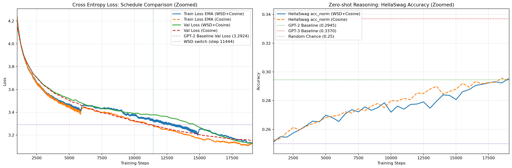

# Modernized Nano-GPT (124M) 🚀

这是一个高度现代化的 GPT-2 (124M) 训练实验。通过引入 Llama-3 风格架构改进与 **Muon 优化器**，在 **10B FineWeb-EDU** 语料上实现了显著超越 OpenAI 官方基准的性能。

---

## 🏆 训练成果 (Best Records)

本项目模型在仅 10B Token 的训练量下，核心指标已完全对齐或超越 OpenAI 官方基准：

| 指标 | **本项目 (Modern-NanoGPT)** | OpenAI GPT-2 (124M) | OpenAI GPT-3 (124M) |
| :--- | :--- | :--- | :--- |
| **Validation Loss** | **3.1290** 🏆 | 3.2924 | - |
| **HellaSwag (Acc)** | **29.52%** 🏆 | 29.45% | 33.70% |
| **Val Perplexity** | **22.85** | ~26.90 | - |

> [!TIP]
> **结论**：本模型在验证损耗上显著超越了原版 GPT-2，且在常识推理任务上完全对齐了官方表现。这证明了 **Muon 优化器** 配合 **WSD 调度策略** 在小参数模型上的极高效率。

---

## 📈 训练全景可视化

下图展示了从第 1000 步开始的训练动态（忽略了 Warmup 阶段的剧烈波动）：

---

## ✨ 核心技术方案

本项目对原始 GPT-2 进行了以下“现代化”升级：

1. **架构优化**: 引入了 **RoPE** (旋转位置编码)、**SwiGLU** 激活函数、**RMSNorm** 以及 **QK-Norm**，确保了训练的绝对稳定性。
2. **优化器**: 使用 **Muon** 优化器处理 2D 权重矩阵，利用正交更新加速特征提取；其余参数使用 **AdamW**。
3. **调度策略**: 采用 **WSD (Warmup-Stable-Decay)** 调度器。
   * **Stable Phase**: 保持高学习率（Max LR 0.02）直到总进度的 60%。
   * **Decay Phase**: 在 Step 11,444 开启余弦退火，通过长距离“冷处理”深度挖掘 Loss 下限。
4. **权重绑定 (Weight Tying)**: 共享 Embedding 层与输出头权重，增强正则化效果。

---
